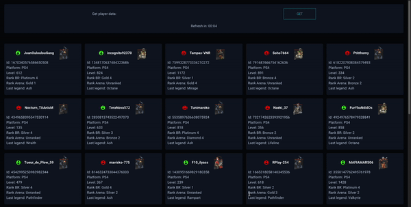

# ApexManager

Web app Node & React for manage Apex Legends club.

## Description

The goal of the project is to create an interface to manage club player in Apex Legends



Main features:

- Display a list of club player
- Get player data such as its platform, but also its level or know if it is connected
- Auto refresh every 4 minutes
- Button for manual refresh

## Installation && Usage

**_The installation and the launch are done in 2 stages in 2 different terminals, the back then the front._**<br/>

#### Back-end: <br/>

`cd ./backend`

Add this in .env.local file:

```
HOST=localhost
PORT=8080
APEXAPI_KEY= your api key
```

Then:<br/>
`npm install`<br/>
`npm start`<br/>

#### Front-end: <br/>

`cd ./frontend`<br/>
`npm install`<br/>
`npm start`<br/>

## Maybe soon...

- Get dynamically the list of players of his club
- Get the last connection date of each player

## Credits :

Data from apexlegendsstatus.com
